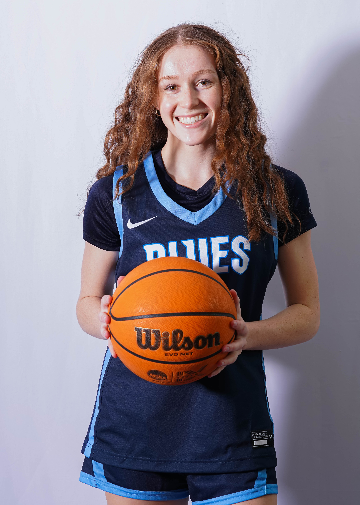

# Carly Martin
(Above and Beyond)

## Introduction
Motivated student-athlete and upcoming graduate from Whitman College, specializing in Mathematics, Economics, and Quantitative Analysis. Proven ability to master complex concepts, demonstrated through tutoring peers and a finance internship at a Silicon Valley startup. Familiar with Microsoft Office (especially Excel), Google Workspace, python, rstudio, and Oracle NetSuite. Seeking to leverage analytical skills and financial acumen in a challenging role within a dynamic organization.

## Education
Bachelor of Arts, Mathematics-Economics, expected May 2025, 3.916 
  Whitman College, Walla Walla, WA

## Data Sources and Project Ideas
1. Sports Statistics - WNBA MVP Race Advanced Metrics
  * **Description:** collection of each of the top 10 WNBA MVP vote-getters from the last 20 seasons and includes each individual's advanced metrics, ranking in their respective MVP race and whether or not they won a championship that year. 
  * **Exploration:** examine which advanced statistical metrics are most effective at predicting MVP, analyze the probability of a champion given a team contains a top 10 player in the league, and visualize which organizations produce most efficient players. 
2. Predicted PM2.5 Concentration Values
  * **Description:** Containts PM2.5 mean, minimum, and maximum predicted concentrations for every county in Oregon collected by the EPA using Bayesian statistical modeling of air quality via air monitoring stations.
  * **Exploration:** explore difference in air quality in urban and rural areas, visualize air quality in specific regions, and analyze correlation between wildfire season and PM2.5 concentration.  
3. Wine Quality
  * **Description:** contains data on various factors impacting red wine quality. Dataset comes from 1599 sensory
evaluations of red Vinho Verde wines from northwestern Portugal.
  * **Exploration:** explore which factors will most maximize consumer satisfaction and analyze the effect of the factors on selling price. 
acidity, chloride, and sulfate levels to maximize consumer satisfaction.
4. Sports Statistics - Examining Shooting Statistics for Stephen Curry
  * **Description:** collection of shooting stats for Stephen Curry including every season of his career.
  * **Exploration:** explore shooting trends over time, analyze the correlation between Stephen Curry's shooting proficency and the 3-point boom in the NBA, and visualize the location of shot selection. 
5. Sports Statistics - Team and Opponent Statistics for The Boston Celtics
  * **Description:** collection of per-game statistics for the Celtics and their opponents.
  * **Exploration:** examine which statistics are most effective at predicting the outcome of a game, which statistical differences in teams are most significant, and analyzing a team's 'identity' from statistical metrics. 

## Where's Schueller?
This heatmap explores professor Schueller's most visited locations on Whitman College campus. 

As expected, the heat map illustrates that Shueller spends a large portion of his time on campus in Olin Hall, specifically on the West side. This is the of the building that the Math department operates in. Additionally, Shueller appears to spend quite a bit of time at the BFFC. Other interesting results include Shueller's propensity to be in Sherwood Athletic Center. This could indicate an interest in athletic events such as Volleyball and Basketball. He also appears to spend decent time in Memorial hall, the Science Building, and Reid Campus Center. Shueller is not in Maxey or the Music Building as often. Finally, while not on Whitman Campus, it is included in the 500 meter radius, Shueller appears to enjoy meals at Big House Brew Pub.

## 2. Portfolio Overview
Specializes in data analytics and visualizations. 

Provide a short summary of the types of projects featured on your page (e.g., data analysis, machine learning, visualizations). 
This gives an overview of what visitors can expect to see.

## 3. Highlighted Projects

## 4. Skills and Technologies
* rStudio
* Python
* Excel
* Oracle NetSuite

## 5. Project Methodologies
Add a note about your approach to the projects, such as using Jupyter Notebooks for interactive data analysis. 
Reference best practices from resources like the Python Data Science Handbook to show your methodical approach.

## 6. Contact Information
**email:** martinc@whitman.edu, carlym2021@gmail.com

**linkedin**: 

## 7. Resume 

## 8. Fact-Based Insights
Consider adding a brief reflection on insights gained from your projects. 
Drawing inspiration from Factfulness by Hans Rosling, highlight your ability to think critically and interpret data accurately.
